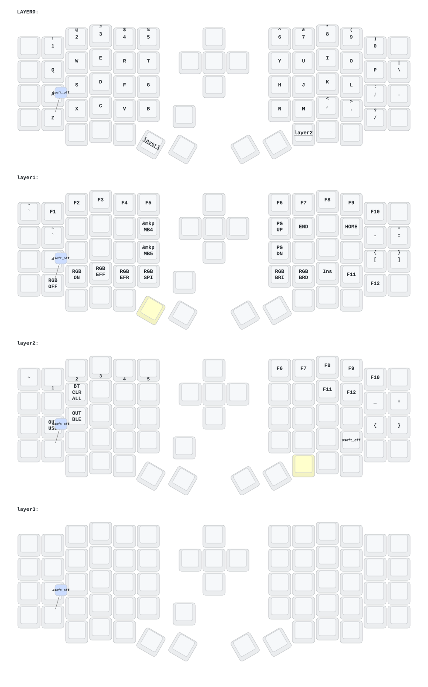

# ZMK Sofle Dongle — DYA Studio

这是为 Sofle 分体键盘、独立接收器和 OLED 底座维护的 ZMK 固件仓库。

本项目在原有底座文件和键位配置上增加 DYA Studio、运行时配置以及接收器按键统计功能。

## 分支说明

| 分支 | 用途 | 状态 |
| --- | --- | --- |
| `main` | 当前稳定固件，基于旧版 DYA/ZMK 技术栈 | 稳定 |
| `4.1` | 基于 `main+dya` 和 Zephyr 4.1 的新版适配 | 开发测试中 |
| `combo` | 旧技术栈上的 Runtime Combo 兼容实验 | 不建议日常使用 |

日常使用请优先选择 `main`。需要测试新版 Runtime Macro 和接收器屏幕编辑时，选择 `4.1`。

## 4.1 分支功能

- DYA Studio 改键
- Runtime Macro
- Runtime Combo
- Runtime Sensor Rotate 编码器配置
- Runtime Input Processor
- BLE 管理
- Settings RPC
- Device Info（固件、硬件和运行状态诊断）
- 接收器 OLED 显示
- 左右手电量显示
- Mac 修饰符图标
- 层级名称居中显示
- 接收器按键统计
- DYA Custom Settings 屏幕设置

### 技术栈

- ZMK：`cormoran/zmk#main+dya`
- Zephyr：`v4.1.0+zmk-fixes+nrf-half-duplex-uart`
- DYA Studio Custom Protocol
- `zmk-feature-custom-settings`
- `zmk-feature-device-info`
- `zmk-feature-runtime-macro`
- `zmk-feature-runtime-combo`

## 固件文件

GitHub Actions 构建完成后，在运行记录的 Artifacts 中下载固件压缩包。

| 固件 | 刷写位置 |
| --- | --- |
| `eyelash_sofle_central_dongle_oled.uf2` | 独立接收器 |
| `eyelash_sofle_peripheral_left...uf2` | 键盘左手 |
| `eyelash_sofle_peripheral_right...uf2` | 键盘右手 |
| `settings_reset...uf2` | 清除 ZMK 配对与设置 |

升级到 `4.1` 分支时，建议接收器、左手和右手使用同一次 Actions 构建生成的固件，不要混用不同分支或不同构建批次。

如连接异常，可依次刷入 `settings_reset`，再重新刷接收器、左手和右手固件并重新配对。清除设置会删除已保存的蓝牙配对和运行时配置。

## Runtime Macro

`4.1` 分支已启用 Runtime Macro，现有 keymap 中的静态 Macro 仍然保留，两者互不冲突。

第 4 层左上角按键绑定为：

```dts
&rmacro 0
```

使用方法：

1. 用 USB 连接接收器。
2. 打开 DYA Studio。
3. 进入 Macro 页面。
4. 创建 Macro 并确认其 Slot 编号。
5. Slot 0 对应当前预留的 `&rmacro 0` 按键。
6. 点击保存后，Macro 会写入接收器设置。

刚刷入固件、尚未创建 Slot 0 时，按下该键不会执行任何内容。

## Runtime Combo

`4.1` 分支已启用 Runtime Combo，可以通过 DYA Studio 在运行时创建和修改组合键。

它与 Runtime Macro 可以共存：Combo 负责监听多个按键位置，Macro 负责执行一串行为。现有静态 `softoff` Combo、静态 Macro 和 Runtime Macro 均保持不变。

使用方法：

1. 用 USB 连接接收器并打开 DYA Studio。
2. 进入 Runtime Combo 子系统页面。
3. 选择空 Slot，设置名称、按键位置、输出行为、适用层和超时时间。
4. 保存并测试；需要断电保存时启用持久化选项。

固件只预留运行时 Combo 槽位，没有增加默认 Combo，因此首次刷写不会改变现有按键行为。

## 接收器屏幕编辑

`4.1` 分支通过 DYA Custom Settings 暴露屏幕选项。进入 DYA Studio 的 Settings 页面，找到 `dongle_display_settings`。修改后点击 `Write` 即时预览；满意后再点击页面顶部的 `Save`，让设置在断电重启后继续保留。

| 设置 | 作用 | 范围 |
| --- | --- | --- |
| `key_stats_enabled` | 是否显示按键统计 | 开/关 |
| `key_stats_x` | 统计模块横坐标 | 0–78 |
| `key_stats_y` | 统计模块纵坐标 | 0–46 |
| `layer_alignment` | 层级文字对齐方式 | 0–2 |
| `layer_width` | 层级名称滚动区域宽度 | 20–78 |
| `mac_modifiers` | Mac/Windows 修饰符图标 | `true`=Mac，`false`=Windows |
| `dongle_battery_enabled` | 是否显示接收器自身电量 | 开/关 |
| `bongo_cat_enabled` | 是否显示猫动画 | 开/关 |
| `modifiers_enabled` | 是否显示修饰符图标 | 开/关 |
| `layer_enabled` | 是否显示层级名称 | 开/关 |
| `wpm_enabled` | 是否显示 WPM | 开/关 |
| `wpm_disabled_layers` | 不显示 WPM 的层名，逗号分隔 | 字符串 |

`layer_alignment`：

- `0`：左对齐
- `1`：居中
- `2`：右对齐

通过 DYA 写入以上设置后，OLED 会立即刷新；点击页面顶部的 `Save` 后可在断电重启后保留。OLED 熄屏继续使用 ZMK 原生的 Idle 机制，当前默认无操作 30 秒后熄屏，不作为独立的 DYA 显示设置开放。

屏幕旋转、分辨率、`segment-offset`、反色和颜色深度仍由设备树固定，不提供运行时修改，以避免 OLED 控制器参数错误导致乱码。

## Device Info

`4.1` 分支仅在接收器固件中启用 Device Info。通过 USB 连接接收器并打开 DYA Studio 的 Troubleshooting 页面后，可以查看：

- ZMK、Zephyr、配置仓库及模块的版本信息
- 编译时间、板型和固件 Build ID
- MCU、Flash、SRAM 和上次复位原因
- USB、BLE、分体、显示等编译配置
- 接收器运行时间和 Zephyr 设备初始化状态

设备信息默认遵循 Studio 的安全访问设置。左右手固件不启用该模块；DYA 读取的是 USB 接收器本身的信息。

## 按键统计

接收器 OLED 显示：

- `T`：历史累计按键次数
- `D`：本次启动后的按键次数

仅统计物理按键按下事件：

- 不统计编码器
- 不统计摇杆或鼠标移动
- 长按自动重复只计一次物理按下

数字会按屏幕宽度缩写，例如：

- `999`
- `1.4k`
- `1.4m`
- `1.4b`

## 编码器

当前 keymap 中：

- BASE：音量控制
- NAV：音量控制
- SYS：上下滚动
- 第 4 层：固定滚动行为

Runtime Macro 和屏幕设置不应修改这些编码器绑定。

## 编译

仓库使用 GitHub Actions 自动构建：

1. 切换到需要构建的分支。
2. 打开 Actions。
3. 运行 Build workflow，或向该分支提交一次改动。
4. 等待全部 Build Job 完成。
5. 下载 Artifacts。

`4.1` 目前属于开发分支。刷写前必须确认接收器、左右手和 `settings_reset` 均构建成功。

## 注意事项

- 不要将 `main`、`combo` 和 `4.1` 的接收器与左右手固件混刷。
- 修改 DYA 运行时设置前，确保连接的是接收器串口。
- 浏览器提示串口已打开时，关闭其他 DYA Studio 页面或占用串口的软件。
- 刷写新版底层后出现连接问题时，优先执行一次完整的 Settings Reset 和重新配对。
- `4.1` 分支仍需通过 Actions 编译和实机验证后再作为日常固件使用。

## 键位图



## 参考项目

- [DYA Studio Developer Guide](https://studio.dya.cormoran.works/developer-guide)
- [cormoran/zmk-feature-runtime-macro](https://github.com/cormoran/zmk-feature-runtime-macro)
- [cormoran/zmk-feature-custom-settings](https://github.com/cormoran/zmk-feature-custom-settings)
- [englmaxi/zmk-dongle-display](https://github.com/englmaxi/zmk-dongle-display)

## 联系方式

如需 3D 打印模型文件，或键盘出现异常和故障，请联系：

`380465425@qq.com`
